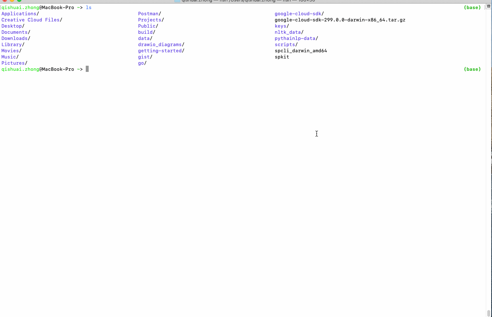
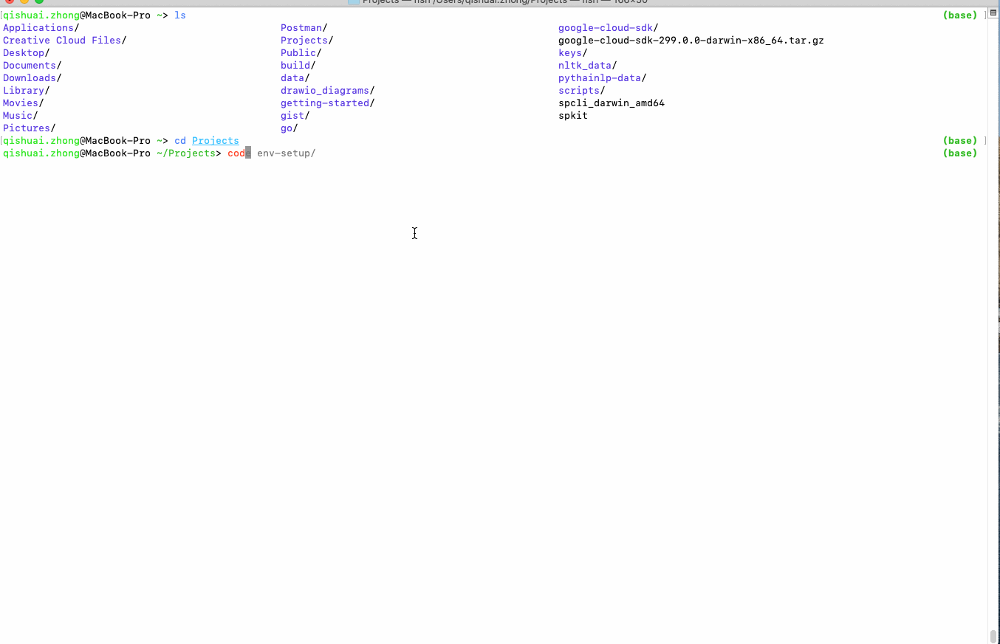
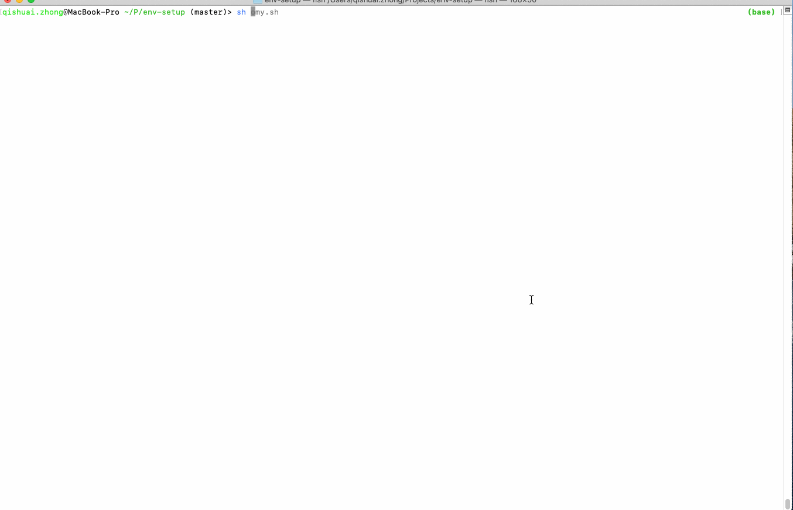
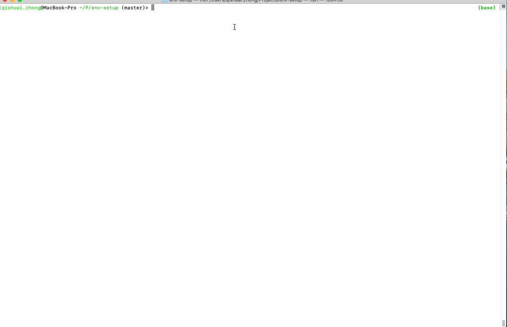
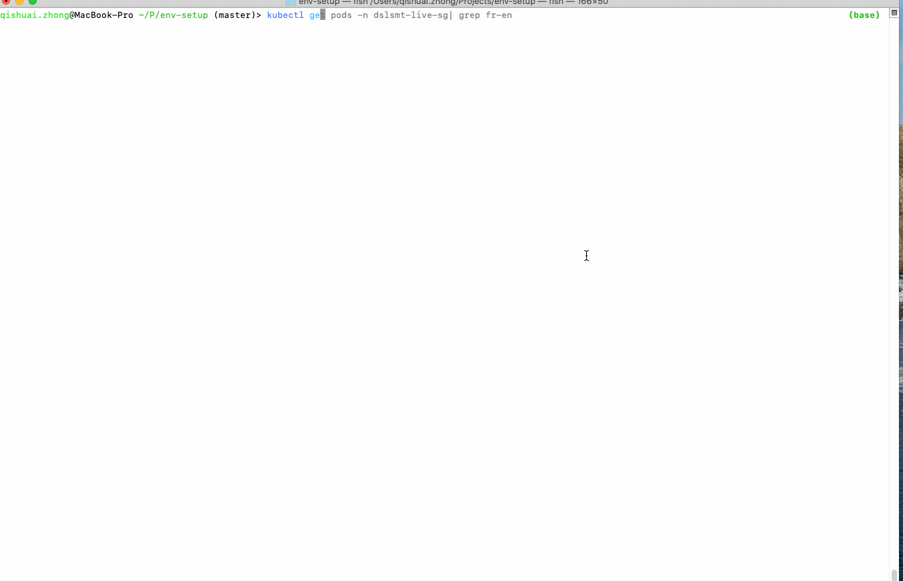

## Why Fish Shell

Fish, "Friendly Interactive Shell" is a very user-friendly shell, it makes our life easier.

### Features

#### Easy to install
Fish shell can directly be installed through conda as `conda install -c conda-forge fish`
Users can define own `config.fish` to configure the shell.

#### Syntax highlighting
Fish can highlight (most) errors in red e.g. misspelled commands and wrong directory.

<figure>
    
</figure>

#### Inline searchable history
Fish allows users to serach shell history while typing the command by pressing the *up* key

<figure>
    
</figure>

#### Inline auto-suggestion
Fish will also give the suggestions upon typing the command.

<figure>
    
</figure>

#### Tab completion
Using tab to see all options while typing the command

<figure>
    
</figure>

#### Kubectl auto completion
Fish can also be configured to do auto completion with kubectl.
Installation: [https://github.com/evanlucas/fish-kubectl-completions] or `kubectl_fish.sh`

<figure>
    
</figure>

#### More configurations
Users can play with fish and do customization with `on my fish`[https://github.com/oh-my-fish/oh-my-fish]